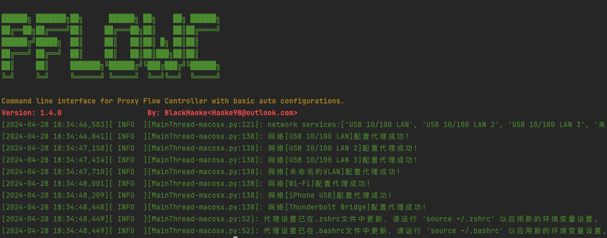

# FlowPilot

A net flow pilot in order to handle some proxy configuration automatically.

### Usage

1. Install
    ```shell
    pip install PFlowC -U
    ```
2. Run
    ```shell
    pflow-cli on
    ```
   
    ```shell
    pflow --help
    ```
   ```
        
    ██████╗ ███████╗██╗      ██████╗ ██╗    ██╗ ██████╗
    ██╔══██╗██╔════╝██║     ██╔═══██╗██║    ██║██╔════╝
    ██████╔╝█████╗  ██║     ██║   ██║██║ █╗ ██║██║     
    ██╔═══╝ ██╔══╝  ██║     ██║   ██║██║███╗██║██║     
    ██║     ██║     ███████╗╚██████╔╝╚███╔███╔╝╚██████╗
    ╚═╝     ╚═╝     ╚══════╝ ╚═════╝  ╚══╝╚══╝  ╚═════╝
    
    Command line interface for Proxy Flow Controller with basic auto configurations.
    Version: 1.4.0                    By: BlackHaoke<Haoke98@outlook.com>
    Usage: main.py [OPTIONS] COMMAND [ARGS]...
    
    Options:
      --help  Show this message and exit.
    
    Commands:
      off      Set off and clear all proxy config.
      on       Run proxy flow controller.
      version  Version

   ```

### TODO

* [ ] Make system proxy setting configuration automatic.
    * [x] MacOS
    * [ ] Windows
    * [ ] Linux
* [ ] Make the command line setting configuration automatic.
    * [ ] MacOS
        * [x] .zshrc
        * [x] .bashrc
        * [ ] auto detect the env file.
    * [ ] Windows
    * [ ] Linux
* [ ] 实现从数据中心拉下来当前地址里位置对应的忽略列表, 以此实现根据地理位置确定忽略哪些地址走代理.
* [ ] Combine with the [zerotier-cli](https://github.com/zerotier/ZeroTierOne).
* [x] Implementing upstream-configurable clash / agent.
* [x] Publish as python site-packages.
* [ ] Release the pre-built packages for all the platform:
    * [ ] MacOSX
    * [ ] Windows
    * [ ] Linux
* [x] Use the mitmproxy implement the new Agent Client.
  * [X] Auto update the bypass domains list by the geoip.
  * [x] router the ignored host for proxy or direct real-time. 

## 引用 & 鸣谢

* thanks to [
  Maximilian Hils](https://github.com/mhils), [Aldo Cortesi](https://github.com/cortesi), [Thomas Kriechbaumer](https://github.com/Kriechi),...
  for [mitmproxy](https://github.com/mitmproxy/mitmproxy)