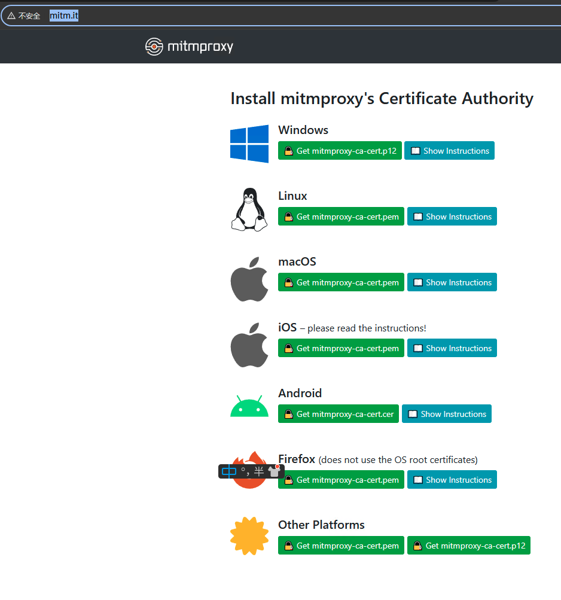

# FlowPilot

A net flow pilot in order to handle some proxy configuration automatically.

### Usage

1. Install
    ```shell
    pip install PFlowC -U
    ```
2. Run
    ```shell
    pflow-cli server
    ```
   
3. 安装证书
   
    否则打开任何站点都出**现证书无效**

    浏览器上访问: [http://mitm.it/](http://mitm.it/)
    
    * Manual Installation
      1. Double-click the P12 file to start the import wizard.
      2. Select a certificate store location. This determines who will trust the certificate – only the current Windows user or everyone on the machine. Click Next.
      3. Click Next again.
      4. Leave Password blank and click Next.
      5. Select Place all certificates in the following store, then click Browse, and select Trusted Root Certification Authorities.
      6. Click OK and Next.
      7. Click Finish.
      8. Click Yes to confirm the warning dialog.
    * Automated Installation
      1. Run certutil.exe -addstore root mitmproxy-ca-cert.cer (details).

* 其他命令可参考Help文档
    ```shell
    pflow --help
    ```
   ```

    ██████╗ ███████╗██╗      ██████╗ ██╗    ██╗ ██████╗
    ██╔══██╗██╔════╝██║     ██╔═══██╗██║    ██║██╔════╝
    ██████╔╝█████╗  ██║     ██║   ██║██║ █╗ ██║██║
    ██╔═══╝ ██╔══╝  ██║     ██║   ██║██║███╗██║██║
    ██║     ██║     ███████╗╚██████╔╝╚███╔███╔╝╚██████╗
    ╚═╝     ╚═╝     ╚══════╝ ╚═════╝  ╚══╝╚══╝  ╚═════╝

    Command line interface for Proxy Flow Controller with basic auto configurations.
    Version: 2.5.0                    By: BlackHaoke<Haoke98@outlook.com>
    Usage: pflow-cli [OPTIONS] COMMAND [ARGS]...

    Options:
      --help  Show this message and exit.

    Commands:
      off      Set off and clear all proxy config.
      on       Run proxy flow controller.
      server   Server as the Agent service for the local device in same LAN...
      version  Version

   ```

### TODO

* [ ] Make system proxy setting configuration automatic.
    * [x] MacOS
    * [ ] Windows
    * [ ] Linux
* [ ] Make the command line setting configuration automatic.
    * [ ] MacOS
        * [x] .zshrc
        * [x] .bashrc
        * [ ] auto detect the env file.
    * [ ] Windows
    * [ ] Linux
* [ ] 实现从数据中心拉下来当前地址里位置对应的忽略列表, 以此实现根据地理位置确定忽略哪些地址走代理.
* [ ] Combine with the Intranet Penetration Tool
    * [ ] [ZT (zerotier-cli) ](https://github.com/zerotier/ZeroTierOne).
    * [ ] [TS (TailScale)]()
* [x] Implementing upstream-configurable clash / agent.
* [x] Publish as python site-packages.
* [ ] Release the pre-built packages for all the platform:
    * [ ] MacOSX
    * [ ] Windows
    * [ ] Linux
* [x] Use the mitmproxy implement the new Agent Client.
    * [X] Auto update the bypass domains list by the geoip.
    * [x] router the ignored host for proxy or direct real-time.
* [ ] 实现流量控制通过程序内部实现而非通过系统的proxy_bypass_domains设置.
* [ ] 利用Curses优化控制台流量展示
* [ ] 实现后台以服务的形式运行
    * [ ] 开发状态栏组件
* [ ] 开发GUI,Desktop应用
* [ ] 利用 [Trojan](https://github.com/trojan-gfw/trojan) 实现可跨过 [GFW](#) 的传统代理.
    * [ ] 同时还可以借鉴 [trojan-go](https://github.com/p4gefau1t/trojan-go).

## 引用 & 鸣谢

* thanks to [
  Maximilian Hils](https://github.com/mhils), [Aldo Cortesi](https://github.com/cortesi), [Thomas Kriechbaumer](https://github.com/Kriechi),...
  for [mitmproxy](https://github.com/mitmproxy/mitmproxy)
* thanks for dnspython
* thanks for geoip2